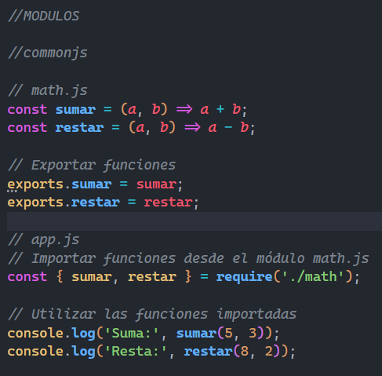
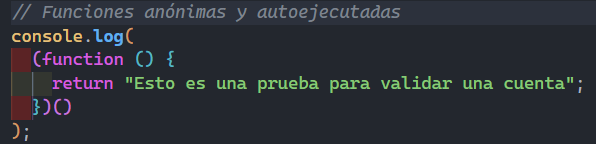

# Laboratorio 2 - Fundamentos y Funciones

## Temas

Los temas que se emplearon fueron:

Fundamentos Basicos

- Variables

  

- Strings

  

- Números

  

- Operadores Comparativos

  

- Operador Ternario

  

* Condicionales

  - Bucles

  

- Funciones

  - Fundamentos básicos

    

  - Funciones Anónimas y Auto Ejecutadas

    

  - Retorno de Funciones

    

  - Funciones Flecha

    

  - Funciones This

    
